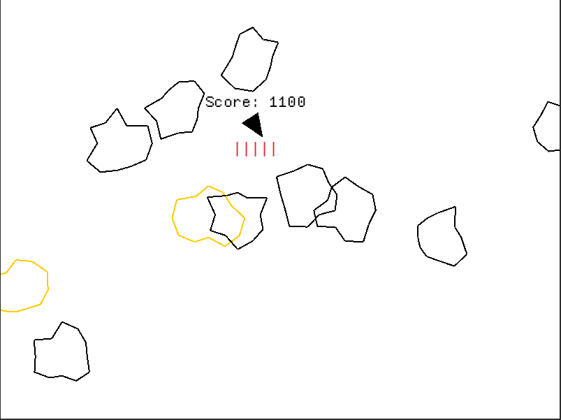

# ASTROID GAME
---

---
This is a simple game I made with the [Macro_quad](https://github.com/not-fl3/macroquad) crate to try out rust.


To play the game, simply clone the repo, cd into the file, and run:
```bash
cargo run
```
Once I feel like im done with the project, you may download the file from releases and run the file.
